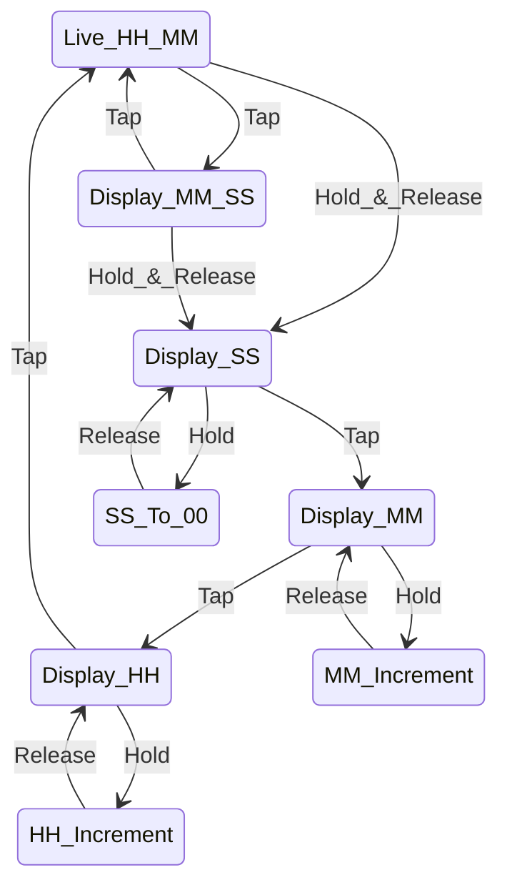

# Clock

## State Diagram

Use a quick press to switch between:

* HH:MM
* MM:SS
* View/edit seconds
* View/edit minutes
* View/edit hours

Do a long hold to start editing.

With seconds, it will display "00". Release at the top of the minute.
With minutes, it will change the value. Release when the minutes is right.
With hours, it will change the value. Release when the hour is right.

## Tools & Debugging

This is project is setup to use `probe-rs`. The setup is based on
<https://github.com/U007D/blinky_probe/tree/main> from the
Embedded Rust Hardware Debug Probe workshop taught at the
Seattle Rust User Group in November 2024.

## License

Licensed under either:

* MIT license (see LICENSE-MIT file)
* Apache License, Version 2.0 (see LICENSE-APACHE file)
  at your option.
