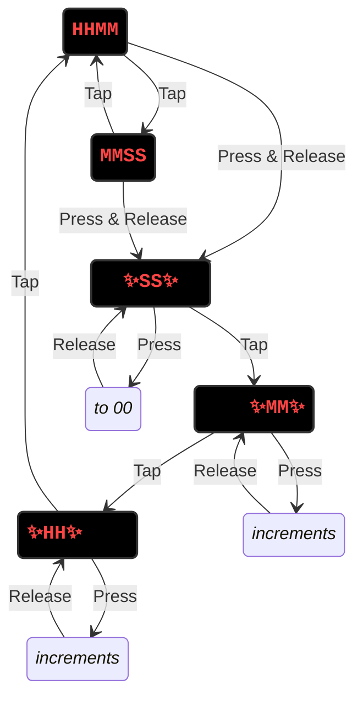

# Clock

## State Diagram

Note: ✨ indicates blinking.

### Display Modes

* HHMM
* MMSS

Tap: Switch between the two display modes.
Press & Release: Move to the edit modes.

### Edit Modes

* SS (blinking)
* MM (blinking)
* HH (blinking)

Tap: Move through the three edit modes and then return to the display modes.
Press: Change the value. Release when the value is right. Seconds go to 00. Minutes and hours increment quickly.

## Tools & Debugging

This is project is setup to use `probe-rs`. The setup is based on
<https://github.com/U007D/blinky_probe/tree/main> from the
Embedded Rust Hardware Debug Probe workshop taught at the
Seattle Rust User Group in November 2024.

## License

Licensed under either:

* MIT license (see LICENSE-MIT file)
* Apache License, Version 2.0 (see LICENSE-APACHE file)
  at your option.
